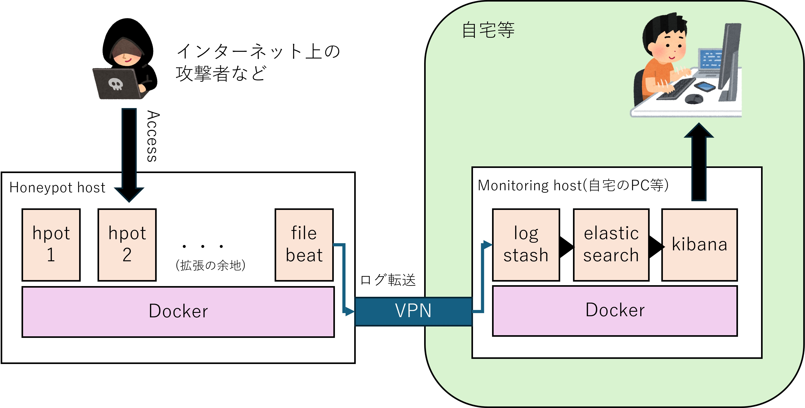

#+TITLE: minipot

* 概要

[[https://github.com/telekom-security/tpotce][t-pot]]のアイディアをベースに作成したシンプルなハニーポット基盤を作成するプロジェクトです。
t-potでは１つのホスト上に各種ハニーポットとログ可視化基盤(ELK Stack)を構築するためある程度のマシン性能が必要ですが、
本プロジェクトではハニーポットとログ集約と可視化のホストを分けて、費用がかかりがちな外部公開ホストで必要なマシン性能をなるべく抑えようしています。

* ハニーポット

現在のところ、本プロジェクトには3つのハニーポットが含まれます。

| ハニーポット名 | プロトコル   | ポート | 概要                                                |
| WOWHoneypot    | http         |     80 | HTTPアクセスに対してすべて200を返すハニーポットです |
| cowrie         | ssh          |   2222 | sshの低対話型ハニーポットです                       |
| beelzebub      | http/ssh/etc |      - | デフォルトでは無効                                  |

* セットアップ

** マシンの推奨構成・スペック

本プロジェクトでは２台のホストを用い、それぞれでハニーポット動作とログ集約・可視化を行います。
ハニーポットを動かすホストを"Honeypot-host"、モニタリング用ホストを"Monitoring-host"と呼ぶこととします。

それぞれで必要なスペック目安は下記です。
（ただし、デフォルト以外のハニーポットをユーザーにて追加した場合は追加のスペックが必要となる可能性があります）

| マシン          | cpu | メモリ | OS         |
| Honeypot-host   |   2 | 2GB    | Linux(x64) |
| Monitoring-host |   4 | 8GB    | Linux(x64) |

ハニーポットもELK Stackもdocker上に構築しているため、Dockerが動作するLinux環境(x86_64)を利用することを推奨します。

** マシンセットアップ

各OSの手順に従い、インストールを実施してください。

** ネットワーク設定

各ホストのNICは下記のように設定する想定です。
それぞれのホストにインターネット接続するためのNICとは別にwireguard用のNICを作成して、wireguradでVPNを張ります。

- Honeypot-host
  - インターネットアクセス可能なグローバルIP
  - VPN(wireguard)
- Monitoring-host
  - 自宅内のLAN（プライベートIP）
  - VPN(wireguard)

Honeypot-hostは外部からハニーポットへアクセスさせるため、直接グローバルIPでアクセス可能とします。
Monitoring-hostはログ集約と可視化のためのホストであるため自宅内のPCやVM等として、一般的なNAT環境下のプライベートIPで動作しているものとします。
これらのホストが直接通信できるように[[https://www.wireguard.com/][wireguard]]を用いてVPNを張ります。

今回は、下記の設定を行ったものとします。Honeypot-hostからMonitoring-host(10.0.0.2)にpingが通ること、
逆にMonitoring-hostからHoneypot-host(10.0.0.1)にpingが通ることを確認してください。

- Honeypot-host
  - VPN IP: 10.0.0.2/24
- Monitoring-host
  - VPN IP: 10.0.0.1/24

** プロジェクトのclone

minipotプロジェクトを各ホスト上にcloneしてください。

#+begin_src 
$ git clone https://github.com/opamp/minipot.git
#+end_src

** Honeypot-host側での設定確認

ハニーポットの設定はdockerコンテナ内部に組み込まれます（volumeによるマウントではありません）。
したがって、起動前に必要な設定変更があれば実施してください。

Honeypot-host向けのdocker-composeファイルは下記のディレクトリに保存しています。

#+begin_src 
$ cd minipot/pots
#+end_src

各コンテナのDockerfileは更にserverディレクトリの対応するハニーポットディレクトリ内部に保存しています。

#+begin_src 
$ cd server/cowrie
#+end_src

各ハニーポットの設定およびdocker-composeの設定ファイルを必要に応じて修正してください。
例えばcowrieのポート番号はホストOSのsshと競合しないためにデフォルトで2222としていますので、
より多くの攻撃を観測する場合は22番になるようにホストOSの設定含めて調整してください。

また、Monitoring-hostへのログ転送はfilebeatで実施します。Monitoring-hostではlogstashでログを受信します。
Monitoring-hostのIPが10.0.0.1ではない場合やMonitoring-host側でlogstashのポート番号を変更した場合は、
filebeatのmain.ymlファイルの宛先IPを修正してください。

#+begin_src 
$ edit server/filebeat/main.yml
#+end_src

#+begin_src 
output.logstash:
  hosts: ["10.0.0.1:5044"] # Monitoring-hostのlogstash宛となるよう修正する
#+end_src

** Monitoring-host側での設定確認

Honeypot-host側と同様にモニタリング用のELK StackはDocker上で動作し、設定ファイルはコンテナ内部に組み込まれます。
下記のディレクトリにて必要な設定調整を実施してください。

#+begin_src 
$ cd minipot/desktop
#+end_src

コンテナのDockerfileは更にserverディレクトリの対応するディレクトリ内部に入っています。
Monitoring-host側はlogstash以外は公式イメージを使用しているため、elastic/kibanaの設定変更はdocker-compose.ymlにて実施してください。
また、今回elasticsearchやkibanaはローカルの環境からのみアクセスすることを想定しているためSSL等の設定を無効化していますので注意してください。

** 起動

各ホストでdocker composeから起動してください。

Honeypot-hostでは下記です。

#+begin_src 
$ cd minipot/pots
$ docker compose up -d 
#+end_src

Monitoring-hostでは下記です。

#+begin_src 
$ cd minipot/desktop
$ docker compose up -d
#+end_src

kibanaは初回起動時に自動で最低限の設定を実施します。コンテナが起動した後も正常にアクセスできるまでしばらく時間がかかります。

* アクセス

Monitoring-host上でブラウザを用いて下記にアクセスすることでkibanaを参照できます。
正常に動作していれば、Honeypot-hostで取得したログがkibanaから閲覧可能です。

#+begin_src 
http://localhost:5601/
#+end_src

* LICENSE

LICENSEファイルを参照してください。
